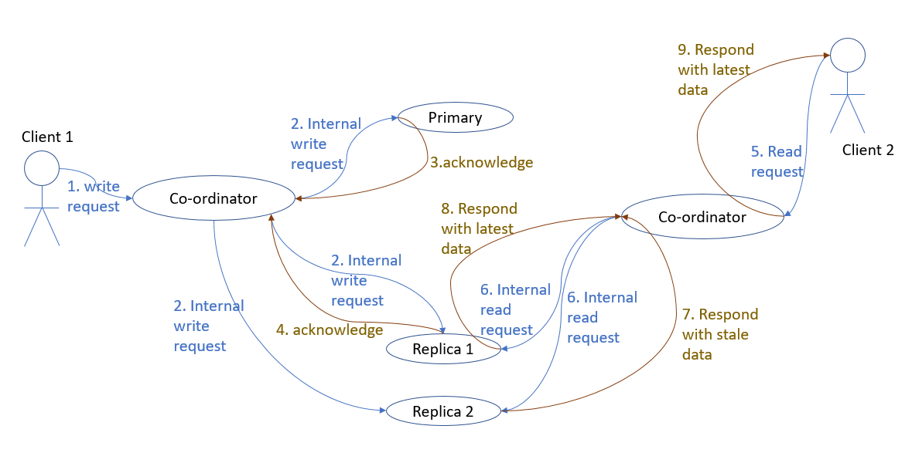
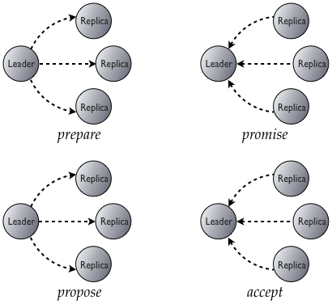
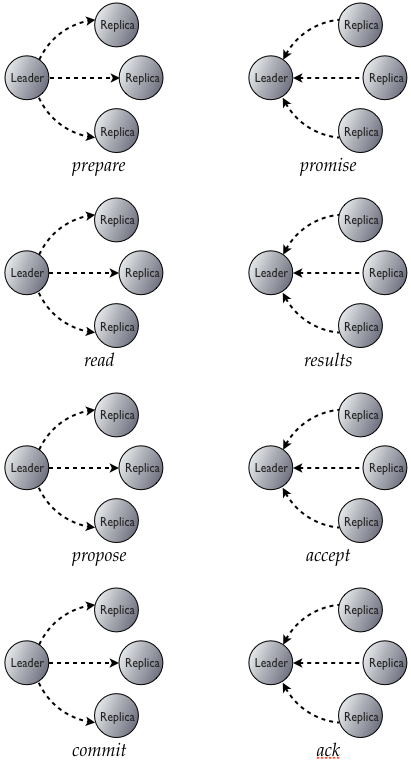

# Verifying consistency guarantees in Cassandra:

*By [Casper Henkes](https://github.com/),
[Marcus Schutte](https://github.com/),
[Emilia Rieschel](https://github.com/rieschel).*

Cassandra is a popular database utilized by numerous large enterprises, including Netflix, Apple, and eBay. One might assume that the consistency of Cassandra has been thoroughly tested and validated. However, as a distributed database that prioritizes availability and partition-tolerance over consistency, encountering consistency issues in Cassandra is a common occurrence. In fact, during our research, we came across comments such as "I am completely discouraged. Is there any workaround for this? If LWT and CAS cannot be used on non-idempotent operations, what is the real use case of the current implementation?" and "To put it simply, Cassandra row isolation is probabilistic at best." Therefore, we delved into the details of Cassandra's consistency guarantees to assess and validate them.

To assess Cassandra's consistency guarantees, we will first analyze its consistency in the context of the CAP theorem. The CAP theorem states that a distributed system can only guarantee two out of three properties: consistency, availability, and partition tolerance. Since Cassandra prioritizes availability and partition-tolerance, it sacrifices consistency to some degree. However, Cassandra provides tunable consistency levels that allow developers to select the degree of consistency required for their applications.

Furthermore, we will examine Cassandra's transactional guarantees related to the ACID properties. ACID stands for Atomicity, Consistency, Isolation, and Durability, and these properties ensure that a database transaction is reliable, even in the event of errors or system failures. While Cassandra does not provide full ACID guarantees, it offers some ACID-like transactional guarantees through lightweight transactions (LWT) and batch operations. These operations allow developers to perform atomic and isolated updates to data, ensuring that data inconsistencies are minimized.

Overall, by examining both the consistency guarantees in the context of the CAP theorem and transactional guarantees related to ACID, we aim to provide a comprehensive evaluation of Cassandra's consistency guarantees.

# Test setup

Our Github repository is forked from [Scalar-labs's repository](https://github.com/scalar-labs/scalar-jepsen). A test cluster is set up with 5 docker containers and 1 control docker container. The machines run Ubuntu 20.04. Cassandra version 3.x is used. See the README.md in our Github repository for a detailed explanation of the setup. 

## Jepsen

In this project we have used the testing framework [Jepsen](https://github.com/jepsen-io/jepsen). Jepsen is a testing tool created by Kyle Kingsbury to analyze the consistency and reliability of distributed databases under various failure scenarios. Jepsen works by subjecting the database system to a series of tests that simulate real-world network and hardware failures, such as node crashes, network partitions, and message loss.

Jepsen aims to find issues in database systems that could cause data loss, data corruption, or violations of the system's consistency guarantees, such as linearizability or serializability. It does this by running a suite of tests that exercise different aspects of the database system's behavior, such as reads, writes, updates, and concurrent transactions.

Jepsen tests generate histories, and checkers are then used to verify the correctness of the histories against a formal model of the expected behaviour. In this project we have used [Knossos](https://github.com/jepsen-io/knossos), which checks for linearizable consistency, and [Gretchen](https://github.com/aphyr/gretchen), which checks if the history is serializable. Additionally, we have adapted some of the checkers found in the Jepsen Github repository. 

# Consistency guarantees

*Change this section depending on what we in the end choose to test and the results we get*

As said, Cassandra is an AP system, meaning that it sacrifices consistency for availability and partition tolerance. The consistency model Cassandra provides is therefore only eventual consistency, meaning that after a write operation, all read requests will eventually return the most recent value, but there may be a delay due to replication and network latency. In other words, eventual consistency means the data will eventually become consistent, but not necessarily immediately. However, Cassandra provides tunable consistency levels that allow developers to select the degree of consistency required for their applications. Casandra even claims when using Quorum consistency levels or higher that strong consistency can be achieved, meaning that any read operation returns the most recent write. Specifically, strong consistency is claimed to be achieved when R + W > RF, where R = Consistency level for read operations, W = Consistency level for write operations, and RF = Replication factor. To verify this claim, let's look more into how Cassandra's replication work and how Cassandra handles concurrent read conflicts with read repair (**TODO**: maybe explain the read repair in more detail? If yes, information can be found here: https://cassandra.apache.org/doc/latest/cassandra/operating/read_repair.html) with an example:

> The following example is taken from [Scott Logic](https://blog.scottlogic.com/2017/10/06/cassandra-eventual-consistency.html). We have a 5-node system and have a replication factor of 3, which means that the data is replicated to three different nodes in the cluster. This ensures that even if one or two nodes in the cluster fail, the data is still available and can be retrieved from the remaining nodes. Let's set both the read and write consistency levels to QUORUM, meaning that a write needs to happen in at least 2 replica nodes before an acknowledgement is returned, and the same for read.
>
> First, a client sends a write request. The coordinator finds out which nodes are the primary and the two replicas. The writes are acknowledged by primary and replica 1 but not by replica 2. Then a read request is initiated, and the coordinator tries to read replica 1 and replica 2. These nodes have inconsistent data, but Cassandra solves this by selecting the data with the most recent timestamp, that is, the data from replica 1. Additionally, a read repair is performed to fix the inconsistencies, which will reconcile the differences and bring all replicas back to sync. In other words, by utilizing timestamps and the read repair technique, the latest data will be returned by the read operation and the strong consistency is fulfilled. 
>
> 

But the question now is, is R + W > RF always fulfilling strong consistency? Can it sometimes result in inconsistencies? What happens for example during node failure? 

> **TODO - Tests:**
> - Verfiying strong consistency - show that inconsistency can happen during node failure (in this article they show examples of when strong consistency do not hold https://blog.scottlogic.com/2017/10/06/cassandra-eventual-consistency.html)
> - Maybe test with other nemesesis as well? 
> - Maybe also test with Knossos and see what it is that fails. Probably however it will only show that some updates are lost. 

When researching Cassandra's strong consistency, we also found that inconsistencies during node failure is not the only issue with the strong consistency. Another issue that can happen is lost writes. [Kyle Kingsbury tested Cassandra 2.0.0 in 2013](https://aphyr.com/posts/294-jepsen-cassandra), and tested among others the strong consistency. He found that when fulfilling R + W > RF and mutating the same cell repeatedly, 28% of the commited updates were lost. What is the reason for this? 

Let's explain the problem with an example again:

> The following example is taken from https://stackoverflow.com/a/73752024. The equation R + W > RF is fulfilled, and we have two clients that want to update a record at the same time, for example they want to increase a value with 100. Both clients read the current value as 10, and they both decide to increase it with 100. Both clients write 110 to the nodes (how many is specified by W), resulting in that any node will have the maximum value of 110. This would mean that we have lost one update of increasing with 100. In other words, strong consistency does guarantee that the most recent write value is read by any read operation. However, it does not prevent lost updates, which Kyle Kingsbury proved in his test.

Instead, to prevent the lost updates we need to somehow serialize the operations. To see if Cassandra offers serializability, let's look into Cassandra's transactional guarantees.

> **TODO** - Sources of nondeternism:
> - Failure during read repair. For example, if the node with the latest write fails, before the write is replicated to the other nodes, what happens then? However, Cassandra tries to mitigate this by using techniques such as hinted handoff and anti-entropy repair. So look more about that to understand what kind of inconsistencies can happen during node failure/network latency. 
> - Last write wins policy potentially causes lost updates. 
> - Last write wins policy - what happens when two clients write an update to the same cell in a table at the same time? Probably it can happen that they update replicas in different order? For example, could the following example happen?: "Consider a scenario where there are three replicas of a partition in Cassandra, and two clients concurrently write to the same partition with different values. Let's say that client A writes the value "foo" to the partition at time T1, and client B writes the value "bar" to the same partition at time T1 as well.Since both writes occur at the same time, there is a chance that different replicas may receive the writes in different orders. For example, replica 1 may receive the write from client A first, followed by the write from client B, while replica 2 may receive the write from client B first, followed by the write from client A. If replica 1 receives the write from client A first, it will store the value "foo" for that partition. However, when it receives the write from client B, it will overwrite the previous value with "bar" since the "last write wins" policy is in effect. On the other hand, if replica 2 receives the write from client B first, it will store the value "bar" for that partition, and when it receives the write from client A, it will overwrite the previous value with "foo". As a result, replicas 1 and 2 will end up with different versions of the data, depending on the order in which they received the writes. This can potentially lead to non-determinism and inconsistencies in the data across replicas."
> - Good articles: https://betterprogramming.pub/cassandra-consistency-guaranties-c8338e051879, 

# Transactional guarantees

Cassandra's standard operations do not provide full ACID (Atomicity, Consistency, Isolation, Durability) transactional guarantees. However, Cassandra has introduced additional features to provide some ACID guarantees: lightweight transactions and batched writes. Lightweight transactions (LWTs) in Cassandra provide atomicity and isolation guarantees on a single partition. This is achieved through a compare-and-set (CAS) mechanism, where write operations are only performed if a certain condition is met. This ensures that only one client can successfully modify a particular row, preventing conflicts and maintaining data consistency. Batch writes in Cassandra guarantee atomicity, meaning that all writes within a batch will either succeed or fail together.

To understand in more detail how isolation is achieved with LWTs, it's necessary to examine how LWTs are implemented in Cassandra.

LWTs are implemented using Paxos consensus protocol. As described by [Datastax](https://www.datastax.com/blog/lightweight-transactions-cassandra-20) Paxos concensus protocol consists of two phases: prepare/promise and propose/accept:



1. Prepare/promise: A node proposes a value; this node is called the leader. Several nodes may try to act as leaders simultaneously, meaning that a leader node in this case is different than a "master" node. The leader chooses a ballot number and sends it to the replicas involved. If the ballot number is the highest one seen by a replica, it promises not to accept any proposals linked to previous ballot numbers and shares the most up-to-date proposal it has received.

2. Propose/accept: After the prepare/promise phase is completed successfully, the leader can send a proposal to the replicas for acceptance. The proposal contains the value the leader wants to commit to the replicated state machine, along with the ballot number that was chosen in the prepare/promise phase. To ensure that the proposal is accepted, the leader must receive acknowledgments from a majority of the replicas. When a replica receives the proposal, it checks the ballot number to ensure that it is the same as the one it received during the prepare/promise phase. If the ballot number matches, the replica accepts the proposal and sends an acknowledgment to the leader. Once the leader receives acknowledgments from a majority of the replicas, the proposal is accepted and committed to the replicated state machine. If the leader does not receive acknowledgments from a majority of the replicas, it must choose a new ballot number and start the prepare/promise phase again. This is necessary to prevent stale replicas from accepting old proposals that are no longer valid.

Using Paxos, LWTs get the ability to agree on exactly one proposal. Since LWT is exposed in Cassandra as a compare-and-set operation, a phase where the current value of the row is read neads to be added. Additionally, the write needs to be commited and acknowledged as well. This results in that LWT are implemented at the cost of four round trips:



Of this explanation, we understand that isolation of the LWTs is achieved by using Paxos and thereby get the ability to agree on exactly one proposal. The question then is, is this enough to guarantee the highest isolation level, serializability? Serializability requires that the execution of a set of transactions in a concurrent system be equivalent to some serial execution of those transactions. Let's test Cassandra's LWT's serializability using Gretchen:

> **TODO:**: Testing lightweight transactions with Gretchen (serializability). Here we want to test both on a single partition and multiple partition, and probably get that serializability is achieved when testing on single partition, and is failing when testing on multiple. Also we should explain here, or before, how data partioning in Cassandra works.

Regarding consistency model, LWTs are guaranteed to achieve linearizability, meaning that sequential consistency is achieved with a time-constraint. This guarantee was tested by [Kyle Kingsbury in 2013](https://aphyr.com/posts/294-call-me-maybe-cassandra). At that time, LWT were a new feature of Cassandra 2.0.0, and several issues were found by Kyle. Among others, it was found that 1-5% of the acknowledged writes were dropped, and the cause seemed to be a broken implementation of Paxos. 

Since we are running our tests on Cassandra 3.x it would be interesting to see if the issues found 2013 are now resolved, and if we can find other issues with the LWT as well.

> **TODO:** Testing lightweight transactions with Knossos. Here we probably will find that everything works fine. 

> **TODO** - Sources of nondeternism
> LWTs retry logic - LWTs ensure that only one client can update the same row at a time, and gives a "condition not met" error to the other clients which results in that they do a retry. What happens when multiple clients try to retry again? Is the correct order still maintained? 
> Node failures - what happens for example when the coordinator node fails? What can the different results be depending on in which of paxos phases we are in?
> In LWTs, a timeouterror can be received even though the write was sucessful, resulting in that you never know 100% if a update was sucessful or not. You can also not read the value again, to see if the update worked, because another client may have updatet the value at the same time. More information about this here: https://betterprogramming.pub/cassandra-consistency-guaranties-c8338e051879 and here: https://issues.apache.org/jira/browse/CASSANDRA-9328. 

Finally, we want to perform a final test on Cassandra's transactional guarantees. Are Cassandra's transactional guarantees provided by the LWT and batch operations, enough to make sure that no money is lost during a bank transaction?

## Bank transaction

A transactional workload that is often used to test consistency of a database is the bank test. In a bank test mony transfers between bank accounts are simulated. For these transactions it is of course important that there is no mony lost during transfer. Moreover bank accounts have the simple constraint that they are not allowed to have a negative amount in the bank.

### Requirements
A bank account could be represented as an integer. A transaction must be atomic. For a mony transfer, mony needs to be subtracted from one account and then added to another one. If there is a failure half way the transaction should roll back. Otherwise mony will be lost. In order for the account to be nonnegative a constraint must be added in the transaction that if the transfer amount is less than the bank account the transaction should fail.

### Cassandra guarantees
The question is: does cassandra give sufficient transactional guaranties to implement the bank test. Using ```batch```, ```counter``` and light weight transactions (```ltw```) as building blocks is should be possible to build a bank test with money transfer. 

The ```batch``` statement [guarantees atomicity and isolation within a single partition](https://docs.datastax.com/en/cql-oss/3.x/cql/cql_reference/cqlBatch.html). the ```counter``` datatype supports [addition and subtracting](https://docs.datastax.com/en/cql-oss/3.x/cql/cql_reference/counter_type.html). Finally, using ```ltw``` a [compare and set operation](https://docs.datastax.com/en/drivers/python/3.2/lwt.html) allows us to check if there is enough mony in the account for a transfer. 

Create the following table: 
```sql
CREATE TABLE test.t (
    id int PRIMARY KEY,
    value counter
)
```
Then combining the three building blocks gives our potential bank transfer:

```clojure
 (defn transfer [from, to, amount] 
    (str "BEGIN COUNTER BATCH "
    "UPDATE bat SET value = value + " amount " WHERE pid = " from "; "
    "UPDATE bat SET value = value - " amount " WHERE pid = " to 
        "IF value > "amount";"
    "APPLY BATCH;" ))
```
However running this query gives an error unfortunatly:

>Conditions on counters are not supported

And if we look closer in Cassandras [cql documentation for counter batch](https://cassandra.apache.org/doc/latest/cassandra/cql/dml.html#counter-batches) we see that counters are not [idempotent](https://docs.datastax.com/en/glossary/docs/index.html#idempotent). Cassandra uses (a modified version) of Paxos for compare and set. If a Paxos round fails to commit the operation will be replayed next round but replaying a counter addition would result in a new value. Light weight transactions only support idempotent data types.

So we drop the constraint that bank accounts have to be non-negative an proceed with the test. We can still expect no mony to be lost in the transfer. The checker checks for every read operation if the total of te balances of every read operation is equal to the expected total.

After running:
``` bash
lein run test --test bank
```
Jepsen throws the following exception during during evaluation:
```clojure
{:type :wrong-total,
    :expected 80,
    :found 85,
    :op
    {:type :ok,
     :f :read,
     :time 69465289700,
     :process 0,
     :value [101 -26 145 80 134 -116 -44 -189],
     :index 21471}}
```
The reads seem to observe the database in an inconsistent state.
To understand what is going on here lets go back to the guarantees that cassandra gives us for batched operations.  
Remember that the batched updates only guarantee isolation for transactions within the same partition. 
In Cassandra the values are hashed to the first part of the primary key. 
Note that however the last read int the history:
```
2	:ok	:read	[-246 -236 -87 153 393 -74 -73 250]
```
Does sum to 80. This demonstrates the eventual consistency property of cassandra nicely. In other words, no mony was lost during the transactions. The transactions executed atomic.

We can  expand the schema to ensure that all the bank accounts are located in the same partition. We do this by adding a partition key to the primary key. The new schedule would be the following:

```sql
CREATE TABLE test.t (
    id int,
    pid int, 
    value counter
      PRIMARY KEY (pid, id)
)
```
Then if we ensure all the ```pid```'s to be equal (for instance 1) we ensure the all the bank accounts to be mapped to the same partition.
If we run this slightly adopted version of the tests again we get:
```
Everything looks good! ヽ(‘ー`)ノ
```
We verify that the counter batch operates in atomicity and isolation as promised by cassandra.

### Introducing Nemesis
Lets see if the batch counter keeps its atomicity when we introduce failure into the system.

## Testing ligth weight transactions

Check with Knossos and Gretchen if LWTs fulfill linearizability and/or serializability. 

# Conclusion
